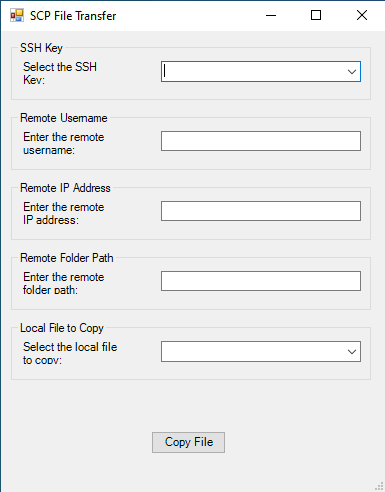

# SCP File Transfer Tool

## Overview

The **SCP File Transfer Tool** is a Windows PowerShell-based graphical utility that simplifies secure file copying (SCP) operations. It features a user-friendly GUI, allowing users to select SSH keys, specify remote credentials, and transfer files with minimal effort. This tool is ideal for users who work with files located in the same directory as the `.ps1` script file.

## Features

- **Graphical User Interface (GUI):** Intuitive and straightforward design.
- **Local File Selection:** Automatically lists all files in the script's directory for easy selection.
- **SSH Key Management:** Lists available SSH keys in the script's directory for seamless integration.
- **Remote Configuration:** Allows entry of remote username, IP address, and target folder path.
- **Error Handling:** Notifies the user of errors, such as missing files or invalid paths.

## How It Works

1. **Start the Tool:** Run the `.ps1` script in PowerShell.
2. **Select SSH Key:** Choose an SSH key from the drop-down list populated from the script's directory.
3. **Enter Remote Details:**
   - Specify the remote username.
   - Enter the remote server's IP address.
   - Define the target folder path on the remote server.
4. **Choose a File to Copy:** Select a file from the available list in the script's directory.
5. **Transfer the File:** Click the "Copy File" button to initiate the transfer. A confirmation or error message will notify the user of the result.

## Prerequisites

- Windows PowerShell installed on the system.
- SCP installed and configured on the system.
- SSH key files and the `.ps1` script must reside in the same directory.
- Network access to the target server.

## Example Usage

### Tool in Action
Below is an example of the tool's GUI representation.



### Example SCP Command
```plaintext
scp -i "path_to_ssh_key" -o BatchMode=no -o StrictHostKeyChecking=no "local_file" user@remote_ip:"remote_folder"
```

## Known Limitations

- Files and SSH keys must be located in the same directory as the script.
- The tool does not currently support recursive copying or file validation beyond existence checks.
- The tool will overwrite existing files with the same name in the remote location
